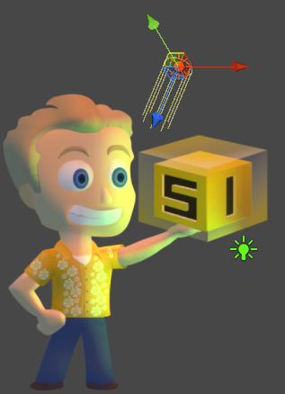

# Unity-Sprite-Illuminator-Tutorial
Dynamic Lighting with SpriteIlluminator

## Normal Maps

A normal mapped sprite consists of 2 files:

The texture itself is used for the sprite's color. 

The pixels in the normal map represent a direction - the direction in which the normal vector of a given pixel is pointing. It's encoded into the color channe - this is where the strange color scheme comes from.

The normal maps were generated using SpriteIlluminator - our [Normal Map Generator](https://www.codeandweb.com/normal-map-generator).

#### Importing Texture and Normal Map

* Click at the image in the Hierarchy and set the texture type to "Texture". Make sure to tick "Alpha is transperancy" if you use a transperant texture.
* Click at the normal map in the Hierarchy and set texture type to "Normal Map". Untick "Create from grayscale".

#### Create Material

* Create a new Material and set the Shader Type to "Transparent - Bumped Diffuse".
* Add the texture as base and the normal map as normal map.

#### Create Quad

* Create a Quad found under "3D Object" and apply the material onto the mesh renderer

#### Add Lights
* With dark ambient light the texture looks like this:

* Select "Edit - Render Settings" and choose a color as ambient light which is used as base color for the texture.

* Add point light to simulate the light of a single source (eg. lamp or fire)

* Add directional light to simulate for example the light of the sun which is coming from the same direction in the same intensity independend of your relative position and distance.

